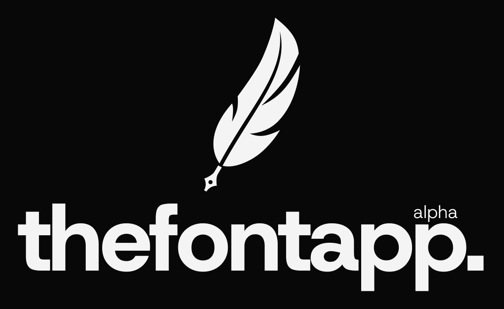

   

 thefontapp is a modern, open source font manager.

---

### why?

font managers meet at least one of the following characteristics:
- it lacks features
- it was made 20 years ago
- it has basic features hidden behind a paywall
- it looks ugly

thefontapp is here to solve this problem. 

---

### how?
thefontapp runs on [wails](https://github.com/wailsapp/wails), so we're able to pack a stupidly fast system integration, with a pretty face.

---

### features (current and planned)
#### manage  
- [x] install fonts (drag and drop)
    - [x] from otf and ttf files.
    - [x] from zip archives.
    - [ ] from rar archives.
    - [ ] from tar archives.
- [x] uninstall font families
    - [ ] uninstall singular style from font family
- [ ] move fonts between folders
- [ ] attach licences to font
- [ ] bulk actions

#### preview
- [x] filter by font name
- [x] change font size, weight, letter spacing, style and alignment
- [x] change display text globally and independently

#### google fonts integration
- [x] all from [preview](#preview)
- [x] install google fonts
    - [ ] select styles to install

#### organize
- [ ] add source folders
- [ ] add families to favorites
- [ ] add tags to families
- [ ] create collections

i probably am forgetting a lot of things though, so i will be updating.

---

### installation
there is not an installation, the app is just a binary file.

i use linux so the only build script i made is for linux.

you're probably good with the wails cli though, it's pretty good.
    
i just use `wails build -clean -platform [platform]`.

[here](https://wails.io/docs/reference/cli#platforms) is the list with available wails platforms.

---

#### thanks y'all for reading <3
